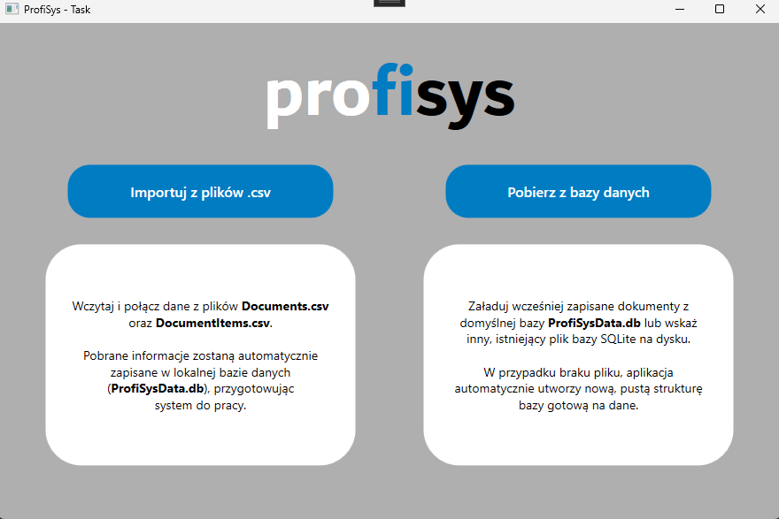
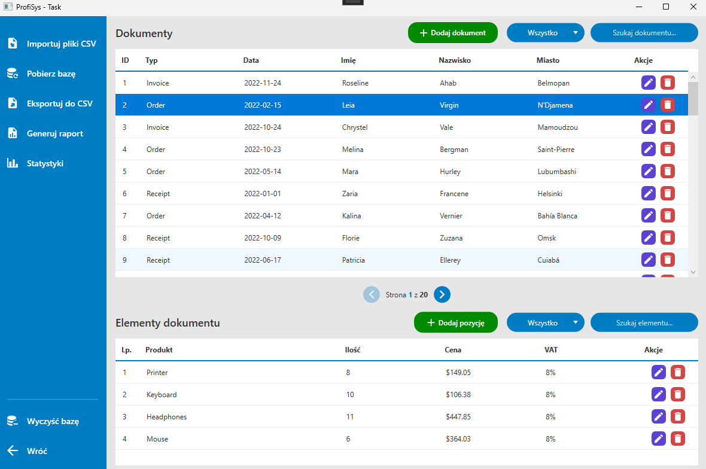

# Document Management System (WPF)

A modern desktop application built with **.NET 10** and **WPF** for managing financial documents and their items. This project was developed as a recruitment task for **PROFISYS**, focusing on clean architecture, the MVVM pattern, and high-performance data processing.

---

## Features

### Core Functionalities
* **Smart CSV Import:** Robust, asynchronous import of large datasets using `CsvHelper` with automatic relational mapping between documents and items.
* **Relational Persistence:** Full integration with **SQLite** using **Entity Framework Core** for reliable data storage.
* **Master-Detail Interface:** Synchronized browsing experience allowing users to view document details and their associated items instantly.
* **Full CRUD Flow:** Comprehensive management of the database, including adding, editing, and deleting records with full data validation.

### Advanced Enhancements
* **Dynamic Filtering:** Type-specific filters (Text, Dates, Products, VAT).
* **Statistics Dashboard:** A dedicated modal providing business insights like Total Revenue, Bestselling Products, and total Item counts.
* **Professional PDF Reporting:** Instant generation of high-quality PDF documents based on selected records using `QuestPDF`.
* **UI/UX Enhancements:** Custom modern design with responsive layouts.
    * **Loading Overlays:** Animated spinners to indicate background processing during I/O operations.
    * **Custom Dialogs:** Styled confirmation modals for critical actions.
    * **Data Pagination:** Implemented to optimize application performance and significantly reduce memory overhead when handling large datasets.

---

## Tech Stack & NuGet Packages

### Framework & Database
* **.NET 10 (WPF):** The latest version of the Windows desktop platform.
* **SQLite:** A lightweight, serverless relational database engine.

### Used Libraries
* **`CommunityToolkit.Mvvm`:** Provides a modern, fast, and modular MVVM foundation. Uses Source Generators to automate boilerplate code for properties and commands.
* **`Microsoft.EntityFrameworkCore.Sqlite`:** A modern Object-Relational Mapper (ORM) that enables efficient interaction with the SQLite database using C# objects.
* **`CsvHelper`:** A fast and highly customizable library used for parsing and mapping source CSV files to domain models.
* **`QuestPDF`:** An advanced library for PDF generation that uses a fluent API to create professional, document-oriented layouts.
* **`Microsoft.Extensions.DependencyInjection`:** The standard .NET IoC container, used to manage service lifetimes and ensure loose coupling between components.
* **`MahApps.Metro.IconPacks.Material`:** A rich library providing Material Design icons to ensure a clean and professional user interface.

---

## Design Patterns & Principles

* **MVVM (Model-View-ViewModel):** Strict separation of concerns between UI and business logic.
* **Repository Pattern:** Abstracted data access layer to ensure the code remains testable and independent of the database provider.
* **Dependency Injection:** Centralized management of services, repositories, and ViewModels.
* **Async/Await:** Fully asynchronous architecture for database, file import, and report generation to keep the UI responsive.

---

## Screenshots




---

## Getting Started

### Prerequisites
* **Visual Studio 2026**
* **.NET 10 SDK**

### Installation & Run
1.  **Clone the repository:**
    ```bash
    git clone https://github.com/OfioNN/ProfiSysTask.git
    ```
2.  **Open the solution:** Launch `ProfiSysTask.sln` in Visual Studio.
3.  **Restore & Run:** Press `F5` to build and launch the application. The SQLite database will be initialized automatically in the `data/` directory.
